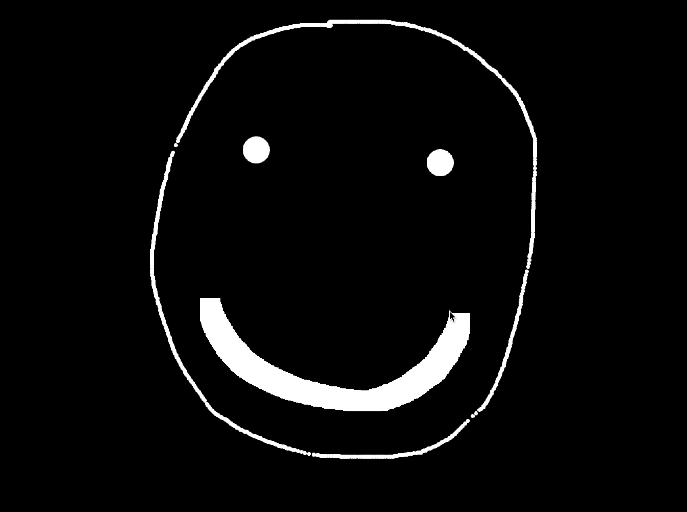
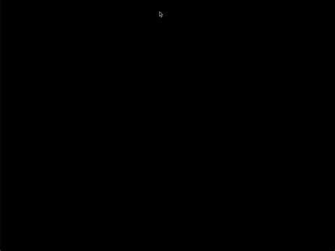

# Assignment_3

## Final Projects

### Project_1

### Concpet Description

This project is basically a short animation showing what Fermi paradox and Dark Forest theory are.  I read the Dark Forest theory from a science fiction, Three-Body Problem, by a Chinese sci-fi writer Liu Cixin. The story in this book is fascinating. Besides, some of the theories and argument came with the story I think are very interesting and worth being contemplated. Dark Forest theory is the most well-known one among them.

This animation is going to be a sequence of drawings displayed in specific order and preset speed. In the explaining process, I want to encourage the user to make assumptions at certain points by clicking different options on the screen. Then different consequences will show up, which push the explanation further until it is finished.

I see this work as an educational animation video as TED-Ed makes, so the user of this work is probably everyone who can access the Internet and is willing to learn something new(?) The difference between TED-Ed video and this work is that it includes interactions which gives the user chances to think and assume before being told the end of the story.

### Interaction

### Project_2

### Concpet Description

For this project, I want to do some data visualization with 3D shapes. Certain existing mathematical formulas can be used to draw 3D shapes, so what I need to do are translating those formulas into instructions in code and rendering 3D models on openFrameworks. 

Data input will change parameters of the 3D shape(s) directly. 3D shapes are shown on the screen with a simple user interface.

Since I haven't decided what kind of data I'm going to use, I don't know exactly who will be my target user. I am thinking of this work as another mean to show the structure of the data or tell the story hidden in the data. (I wish)This might help users draw new insights from raw data.

### Movement

### Project_3

### Concpet Description

This project is going to be a small and light game about modern people's compulsions, which can be super wired, creepy or unmentionable. The purpose of this game is to tell everyone it's perfectly ok to have these uncontrollable behaviors. Living in this world, everyone is unique, but no one is a weirdo, and when you actually play with them, they are not able to bother you any longer. 

Interactions involved in this game will be very simple. I hope the user can get close to their inner feelings of compulsions by doing some straight forward and repeating actions. In this game, the user will be acting like a stubborn but nice old man dealing with his odd habits in a funny way.

There isn't any target user for this game. It's going to be designed for everyone.

### Movement and Interaction

## Weekly Project

### Screenshots

