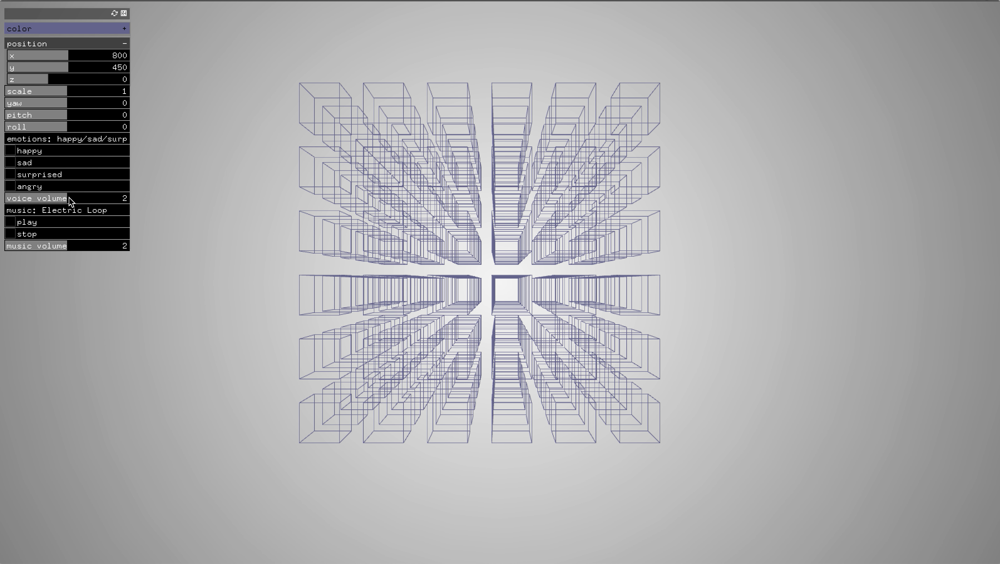
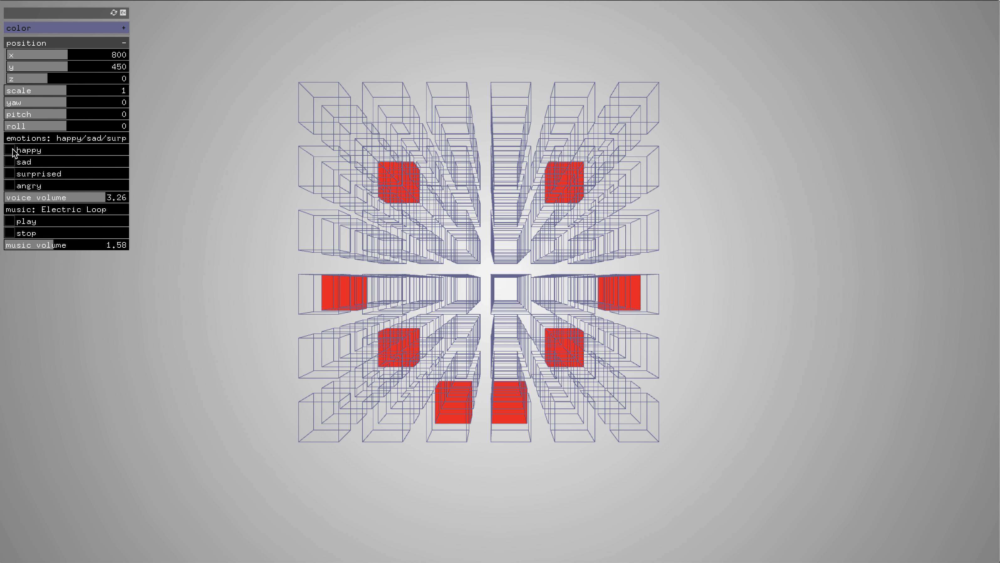
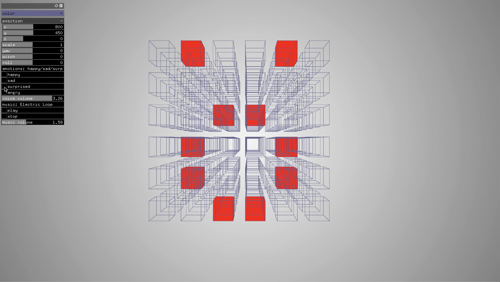
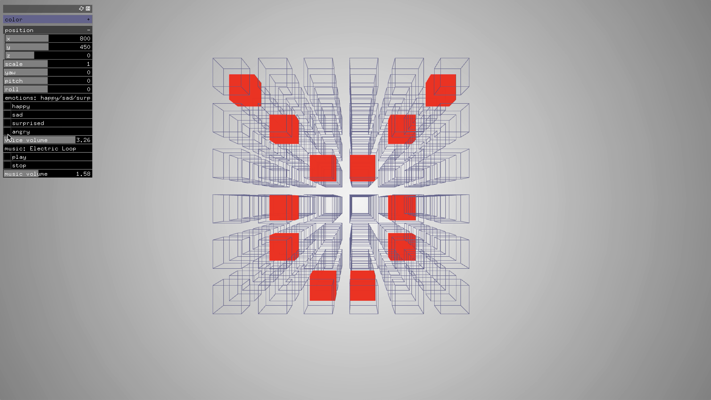
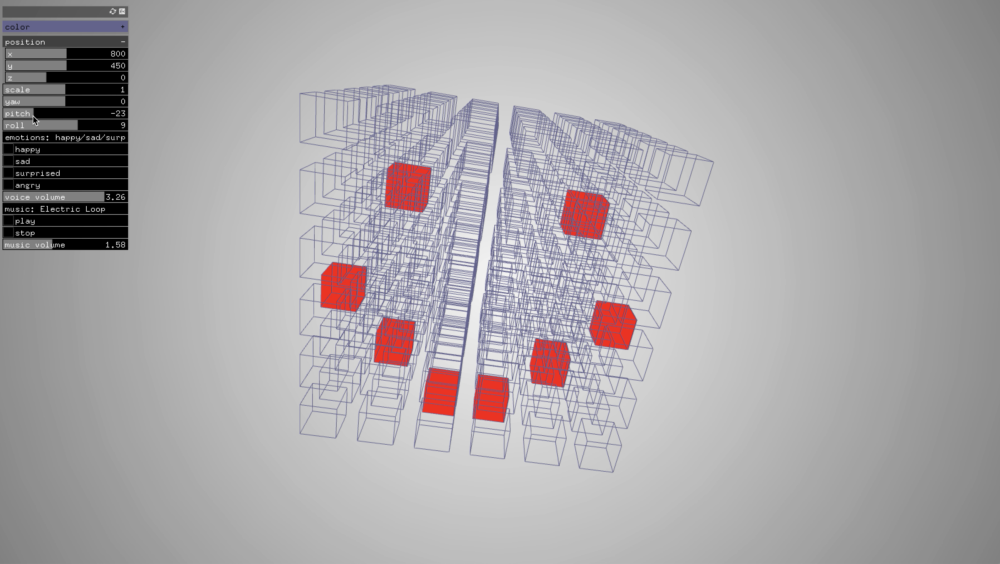
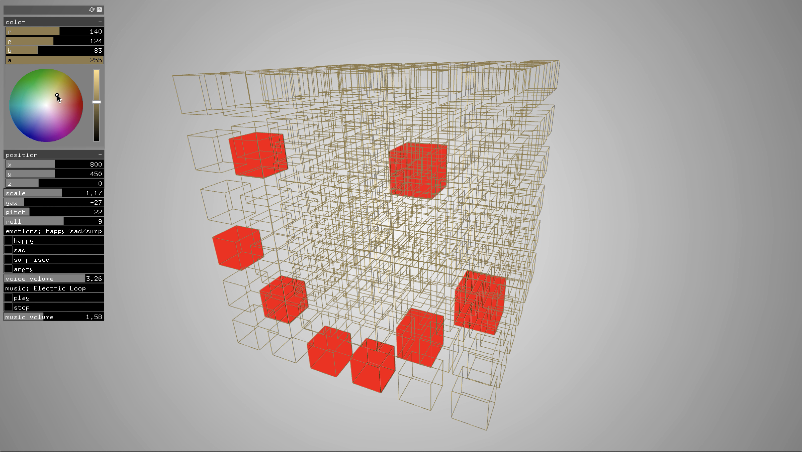
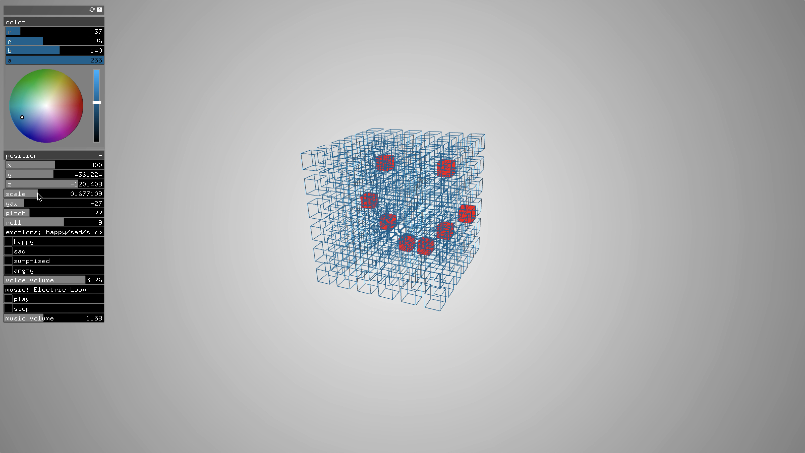
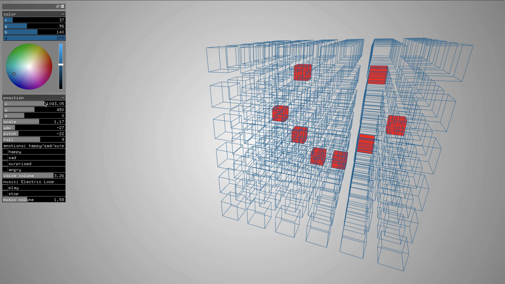

# Assignment_7

## Weekly Project - UI & oFx Matrix

### Requirements
Create a new project using the code from the last emotion assignment.

Remove all timer related changes and movement.

Create a UI with the following:
* An ofxFloatSlider to control the sound volume 
* An ofxButton to rotate between which emotion is being displayed
* An ofxVec2Slider to change the x,y of all shapes being drawn
* An ofxColorSlider to select the color of one shape in the drawing
* An ofxIntSlider shape movement (degree of emotion)
* Appropriate labels

Use translation, scaling, and rotation to add at least 3 new features to the existing emotions.

Ex:

Y rotation could make eyes squint/blink or eyebrows arch.

Scaling could widen eyes in surprise or narrow them in distrust

Translation could move pupils (or any other feature) around.

### Screenshots

**Emotions**

**Rotating**

**Scaling**

**Selecting the color**

**Link to Youtube video:**

