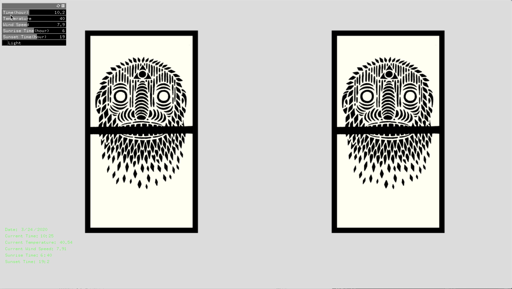
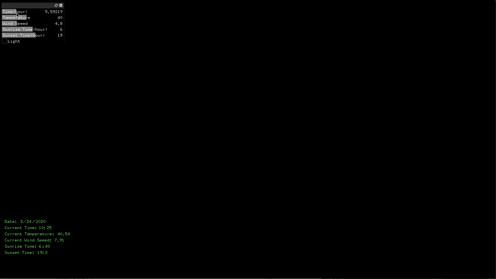
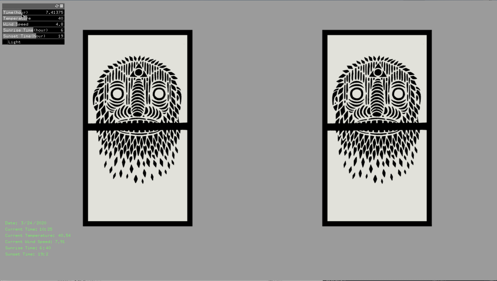
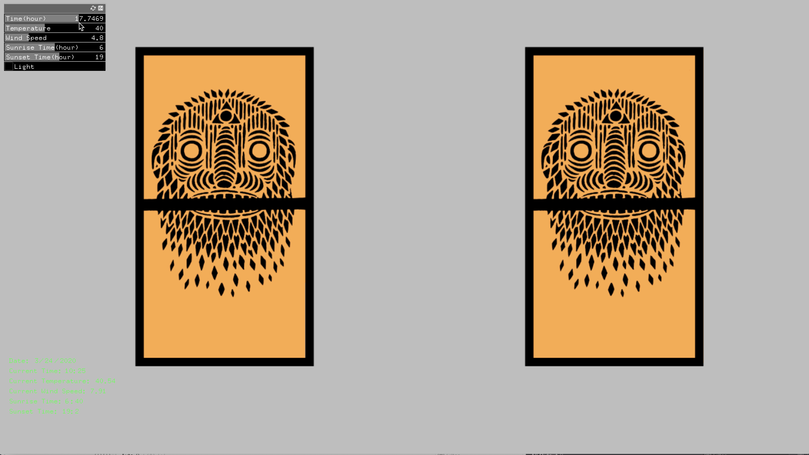
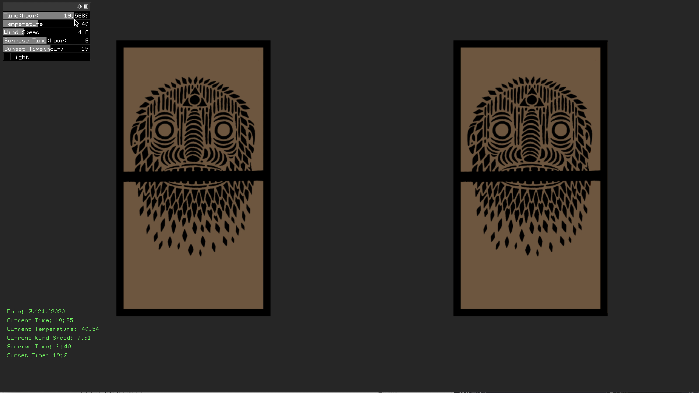
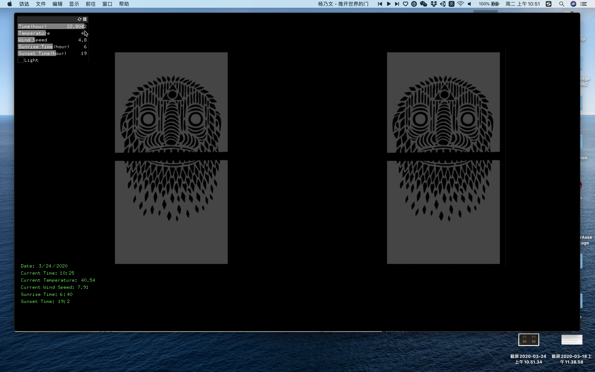
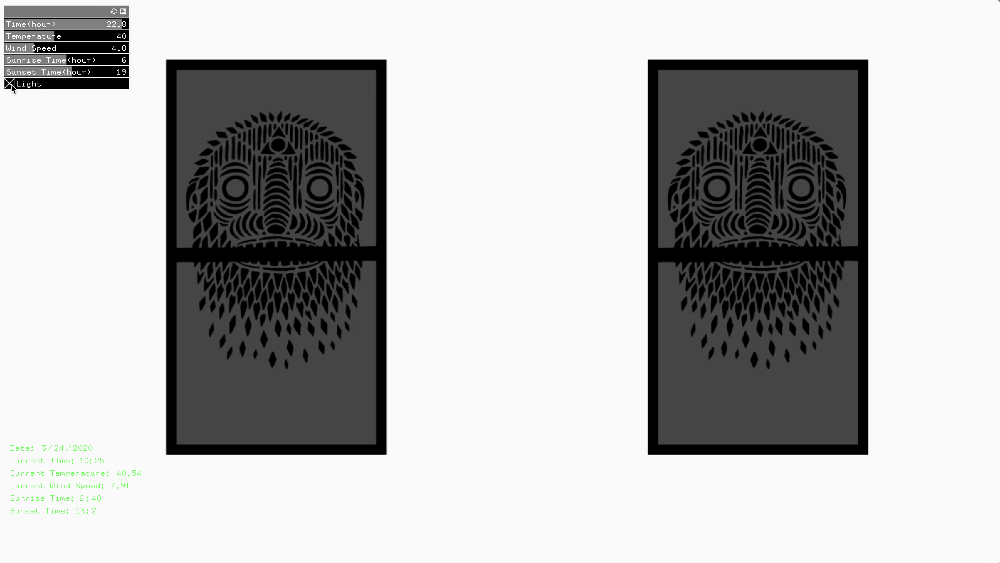

# Assignment_8

## Weekly Project - External Events

### Requirements
Clone the [ofxJSON Addon](https://github.com/jeffcrouse/ofxJSON) and put it in the "addons" directory.

Get an API key on darksky.

Create a new project using ofxJSON.

Get latitude and longitude for any city on the planet.

Craft a "Forecast Request" URL for your city.

NYC Example: https://api.darksky.net/forecast/YOUR_KEY/42.3601,-71.0589

Make the request and print the resulting JSON out via cout.

Within the window print time (in epoch format), sunriseTime, sunsetTime, temperature, and two other values of your choice.

Use integer division to calculate and additionally print the current day of the year, hour, and minute. 

Translate 4 values from the above request to a visualization.

Create an appropriate GUI to manually force each value.  (show changes in your video)

Example: Use sunrise/sunset/hour to change the background color.  Use temperature to change the color of a leaf.

Prepare your first project for next week's crit.

### Description
In this project, the weather forecast data in this city(NYC) is from Dark Sky API. Five values are extracted from the resulting JSON file: Time, Temperature, Wind Speed, Sunrise Time, and Sunset Time. The scene I simulated is the view that I used to see in a classroom(D1208) on D12.

As time flows forward in one day, you can see that the light coming from two windows in the classroom is constantly changing. Both sunrise time and sunset time here can be re-set manually through GUI panel and shown in the light changing progress. The background sound in this project is a wind sound effect. Its volume depends on how strong the wind is. I also added one more button in the GUI panel. This button is a light switch, with which lights in this room are able to be turned on and off.

### Screenshots
**Current Time(10:25 a.m.)**

**Before Dawn**

**Sunrise**

**Sunset**

**At Night**

**Lights On**

**Link to Youtube video:**

