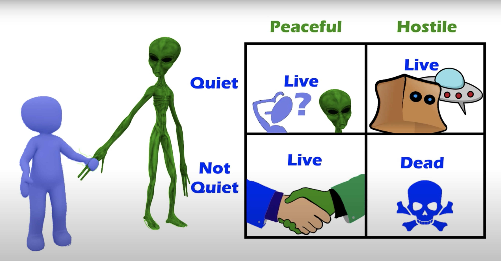
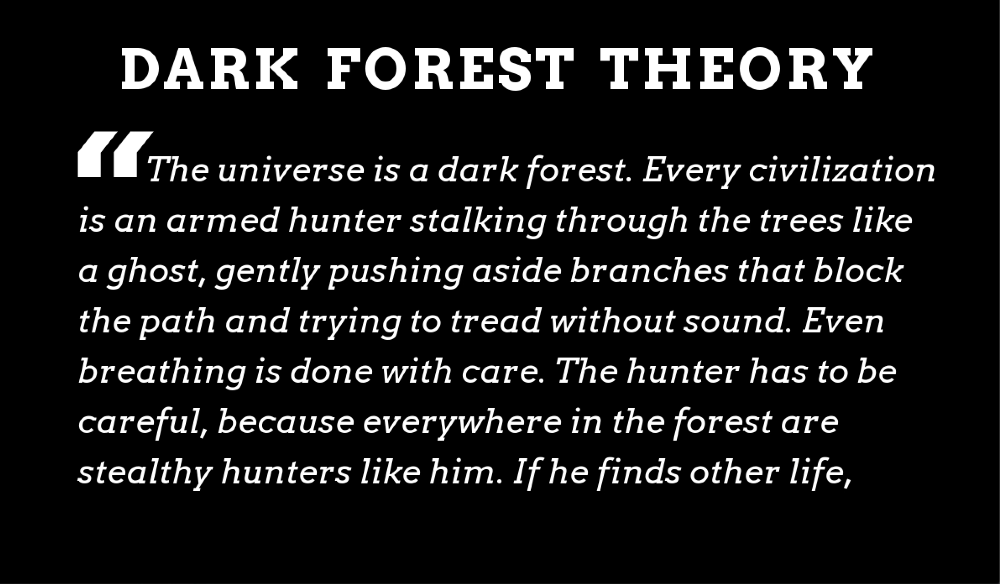
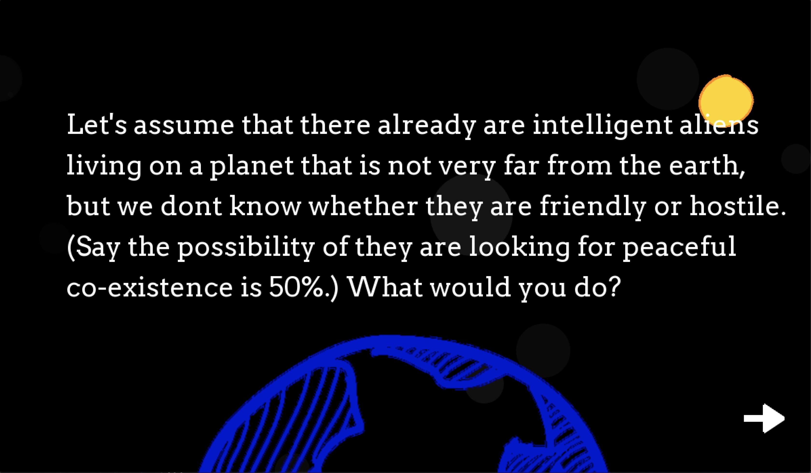
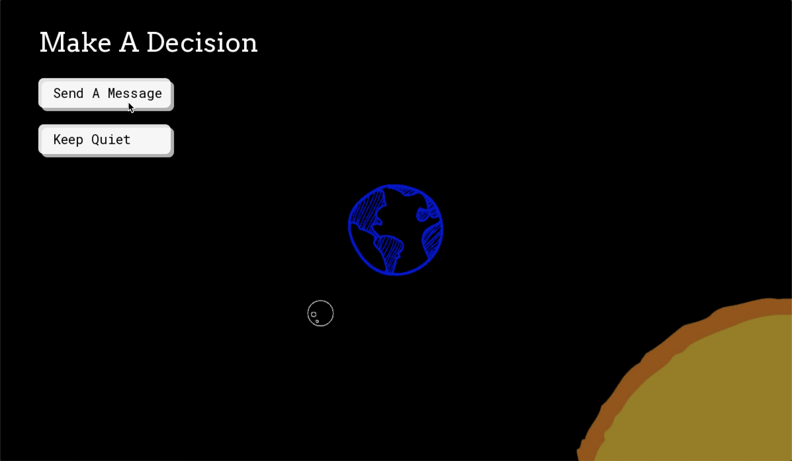
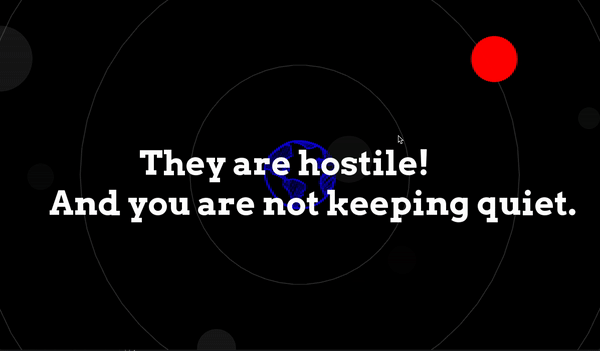
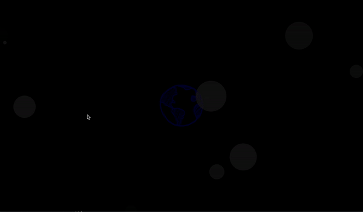
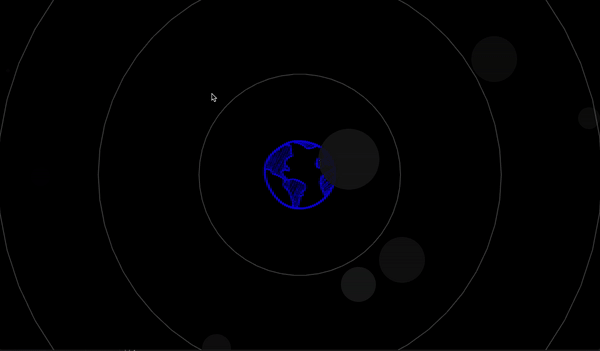
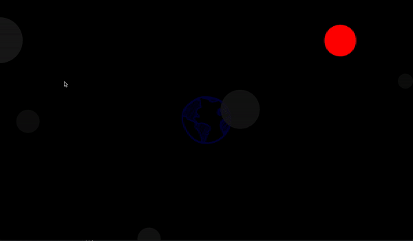

# Project_1

## Description ##
This project is a small app based on the Fermi paradox and Dark Forest theory that is from a science fiction, Three-Body Problem, by a Chinese sci-fi writer Liu Cixin. I tried to translate these two theories through simple game mechanics and show how they work together in the universe.

At the beginning of this game, I quote the Dark Forest theory in order to provide some background information for the player. While they are reading that, a background sound is being played automatically. The sound is an interesting audio illusion, the Shepard Tone. It creates the impression of an always rising or falling pitch that really doesn't get anywhere. It gives the player a feeling that it’s always going up or down, but meanwhile, it’s stuck in an eternal auditory. That impression perfectly matches the feeling I had about the dark and immeasurable universe when I was reading the book, so I decided to play it here.

Moving to the game part, the player needs to make a decision on if we should send a message (radio signals) to the universe. There is no doubt that this message will expose our location to potentially existing neighbors, intelligent aliens living on the other side of the universe. If they are friendly creatures, we are going to co-exist peacefully, but if they are hostile to us, we might get killed. In this game, I set the possibility of the aliens are friendly is 50%. With two different decisions that players may make, there are four consequences in total at the end of the game. 

**Reference:** [The Fermi Paradox: Dark Forest Theory](https://www.youtube.com/watch?v=zmCTmgavkrQ)

## Screenshots ##

**Link to Youtube video:**

