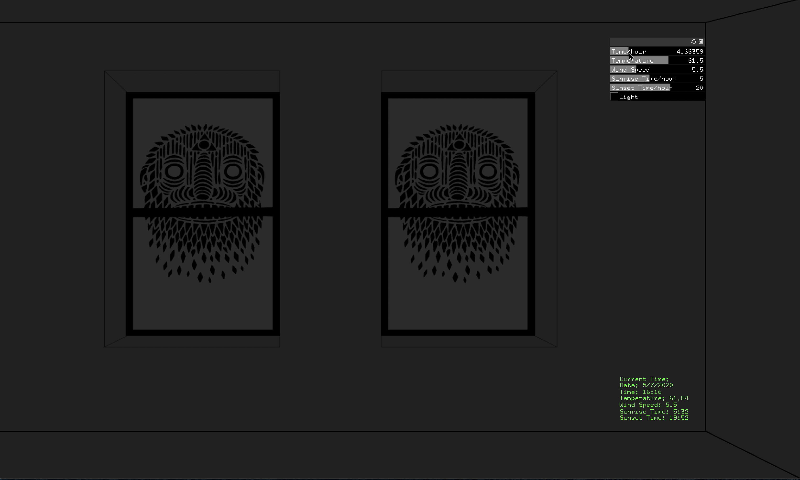
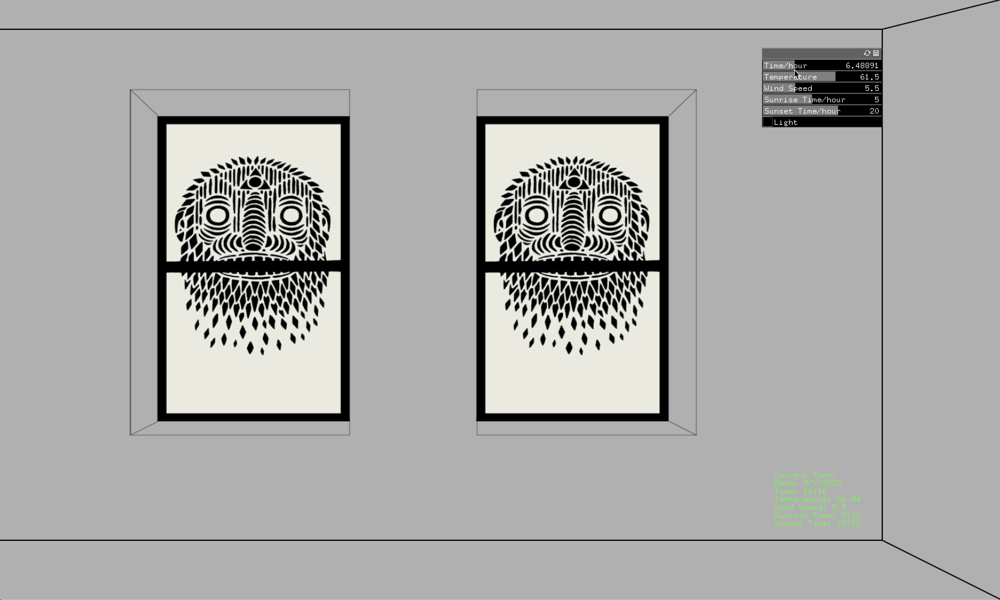
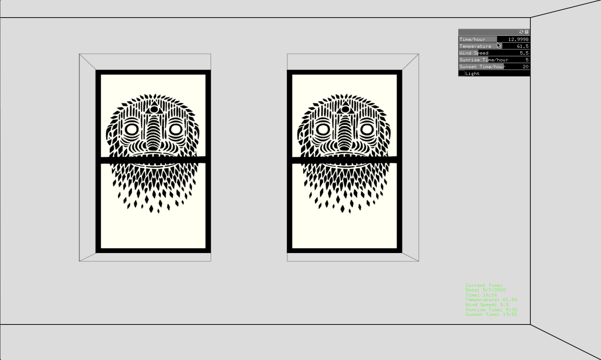
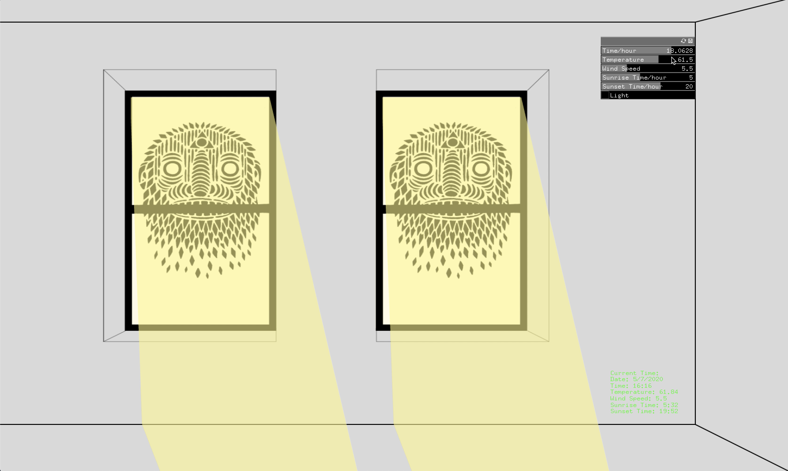
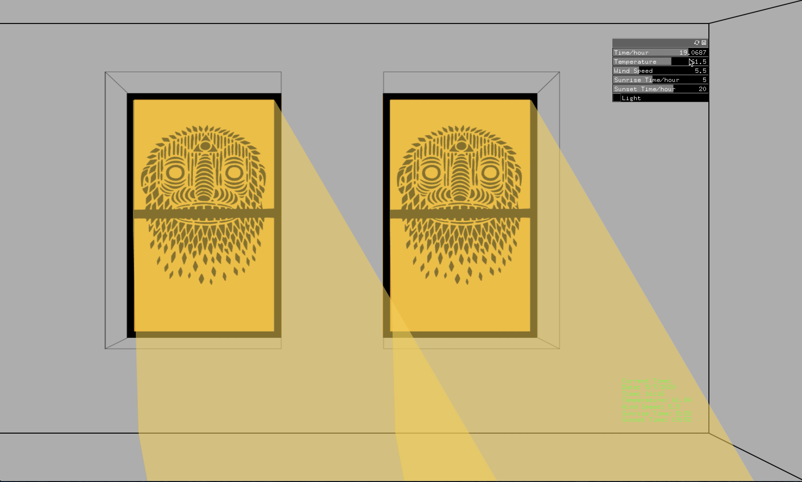
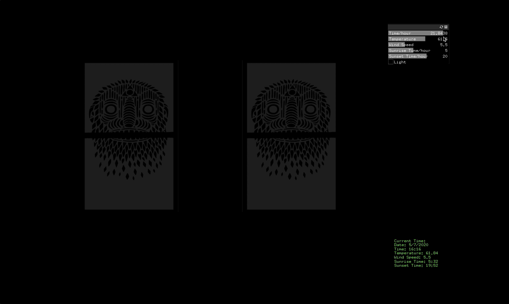
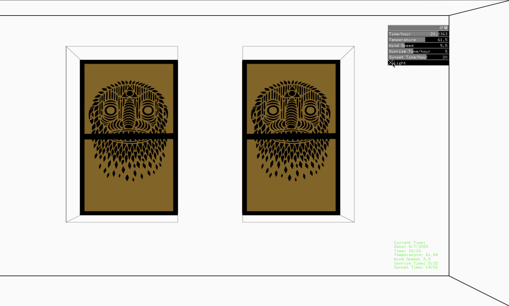

# Project_2

## Description ##
My Project_2 is a refined version of Assignment_8. But different from that, there is sunlight that can be seen coming into the room through windows and the room is also sketched as a three dimensinal space.

In this project, the weather forecast data in this city(NYC) is from Dark Sky API. Five values are extracted from the resulting JSON file: Time, Temperature, Wind Speed, Sunrise Time, and Sunset Time. The scene I simulated is the view that I used to see in a classroom(D1208) on D12.

As time flows forward in one day, you can see that the light coming from two windows in the classroom is constantly changing. Both sunrise time and sunset time here can be re-set manually through a GUI panel and shown in the light changing progress. The background sound in this project is a wind sound effect. Its volume depends on how strong the wind is. I also added one more button to the GUI panel. This button is a light switch, with which lights in this room are able to be turned on and off.

## Screenshots ##
**Dawn**

**Sunrise**

**Noon**

**Sunset**

**Night**

**Lights On**

**Link to Youtube video:**

